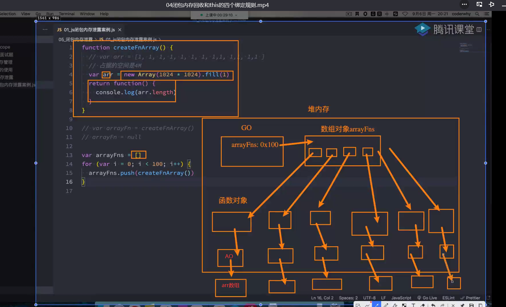
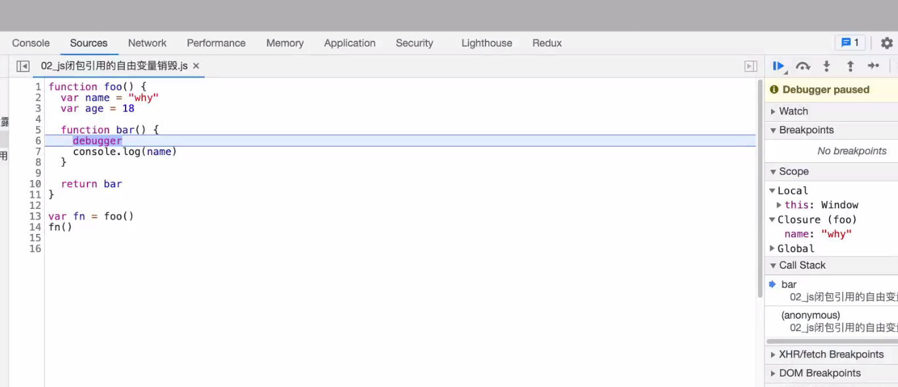

## 闭包的内存泄漏
```var arr  = new Array(1024*1024).fill(1)```

在JS中number类型的类型占8个字节(2的64次方) 但是js引擎 V8引擎会根据具体数字类型分配空间 
整数在V8中成为Sim 分配4个字节2的32次方

4byte * 1024 *1024
=4byte*1024=4kb*1024=4M


闭包中没有引用到的自由变量 JS引擎V8会自动对这个自由变量进行销毁



## this指向四个规则

this指向与函数所在的位置没有关系 
跟函数被调用的方式有关
this是在运行时被绑定的 记录在函数执行上下文中

全局作用域下
   - 浏览器：window
   - Node环境：{}  
     在Node环境中js文件运行过程：module(js文件)——>加载——>编译——>放进一个函数——>执行函数.call({})

1. 默认绑定
  独立函数调用 指向window
2. 隐式绑定
   对象.方法()
3. 显示绑定
   函数.call()  函数.apply()  函数.bind()
4. new关键字绑定  
   new构造函数 this指向新创建的对象 